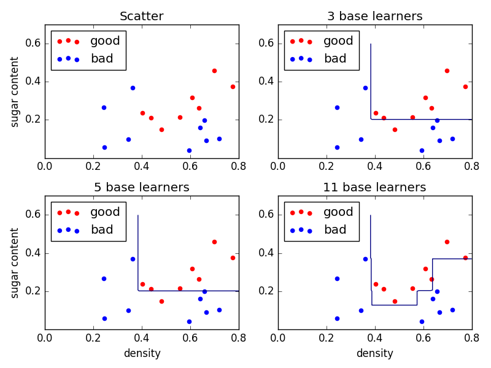
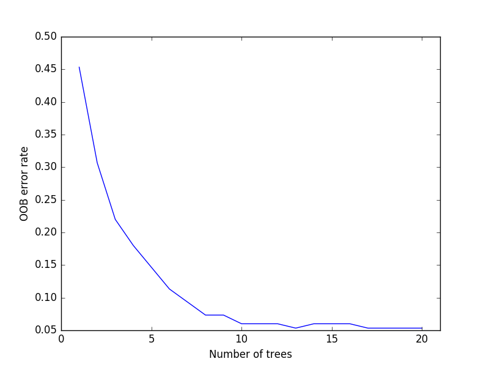

# MLDemos —— Machine Learning Demos

## Ensemble learning
### Adaboost algorithm
Classifier boundary becomes more accurate with the number of base learners increasing.  

### Random Forest
Out of bags error rate decreases with the number of trees growning.
